<div align="center">

# 👋 Hey, I'm **Prince Kumar**

### `Aspiring Software Engineer` • `Java & DSA` • `AI & Data Science`

<p>
  <a href="https://github.com/princekumar2222">
    
  </a>
  <a href="https://www.linkedin.com/in/princekumar2222">
    
  </a>
  <a href="https://leetcode.com/u/princekumar2222/">
    
  </a>
  <a href="https://princekumar2222.github.io/">
    
  </a>
</p>

</div>

---

## 🚀 About Me

I'm a **B.Tech Computer Science student specializing in AI & Data Science** at **GLA University**.

I enjoy solving programming problems, building practical projects, and continuously improving my skills in software development, DSA, databases, and AI.

```text
🎯 Goal        → Become a strong Software Engineer
☕ Main Focus  → Java + DSA + Problem Solving
🤖 Exploring   → AI & Data Science
🐍 Learning    → Python + Machine Learning
🗄️ Database    → SQL + DBMS
🚀 Building    → Real-world Projects
```

---

# 🛠️ Tech Stack

### 💻 Languages

<p>
  
</p>

### 🌐 Web Development

<p>
  
</p>

### 🗄️ Databases

<p>
  
</p>

### 🔧 Tools & Platforms

<p>
  
</p>

---

# 📊 GitHub Activity

<div align="center">



</div>

---

# 🔥 GitHub Contribution Streak

<div align="center">



</div>

---

# 📈 Contribution History

<div align="center">



</div>

---

# 💻 Coding Journey

<div align="center">

### 🧩 LeetCode

<a href="https://leetcode.com/u/princekumar2222/">
  
</a>

<br><br>

### 🐙 GitHub

<a href="https://github.com/princekumar2222">
  
</a>

</div>

---

# 🚀 Featured Projects

## 🏫 School Attendance System

A practical web-based attendance management system for simple and efficient school attendance tracking.

**Tech Stack**

`Node.js` `Express` `SQLite` `HTML` `CSS` `JavaScript`

---

## 🆘 HelpMeApp

An Android emergency assistance application designed for quick access to emergency actions such as SOS messaging and emergency calling.

**Tech Stack**

`Java` `Android` `SMS Intent` `Phone Intent`

---

## 💻 DSA & LeetCode Solutions

A collection of Java solutions created while improving algorithmic thinking, problem-solving ability, and DSA fundamentals.

**Tech Stack**

`Java` `DSA` `Algorithms` `LeetCode`

---

## 🌐 Personal Portfolio

My personal developer portfolio showcasing my skills, projects, and learning journey.

**Tech Stack**

`HTML` `CSS` `JavaScript`

---

# 📚 Currently Learning

```text
☕ Java
   └── Data Structures & Algorithms

🧠 DSA
   └── Problem Solving + Algorithms

🗄️ DBMS
   └── SQL + Database Concepts

🐍 Python
   └── Data Science

🤖 AI / ML
   └── Artificial Intelligence Fundamentals

💻 Software Engineering
   └── Projects + Development
```

---

# 🎯 2026 Goals

* [x] Solve 200+ LeetCode problems
* [ ] Strengthen Java DSA
* [ ] Build more real-world projects
* [ ] Learn Machine Learning
* [ ] Improve SQL & DBMS
* [ ] Contribute to Open Source
* [ ] Get a Software Engineering Internship

---

# 🌐 Connect With Me

<div align="center">

<a href="https://github.com/princekumar2222">
  
</a>

<a href="https://www.linkedin.com/in/princekumar2222">
  
</a>

<a href="https://leetcode.com/u/princekumar2222/">
  
</a>

<a href="https://princekumar2222.github.io/">
  
</a>

</div>

---

<div align="center">

### ⚡ Learn. Build. Solve. Repeat.

⭐ **Thanks for visiting my profile!**

</div>
